# Simple Docker

## Part 1. Готовый докер

**== Task ==**

##### Взять официальный докер образ с nginx и выкачать его при помощи `docker pull`.
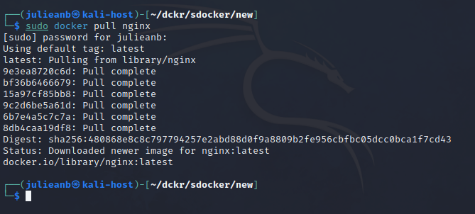


##### Проверить наличие докер образа через docker images
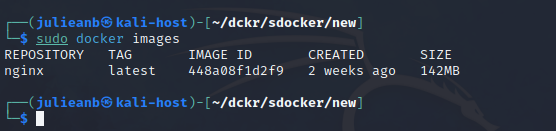


##### Запустить докер образ через docker run -d [image_id|repository]
##### Проверить, что образ запустился через docker ps
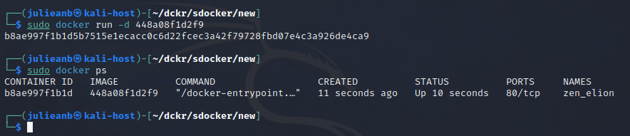


##### Посмотреть информацию о контейнере через docker inspect [container_id|container_name]
##### По выводу команды определить и поместить в отчёт размер контейнера, список замапленных портов и ip контейнера
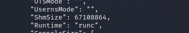
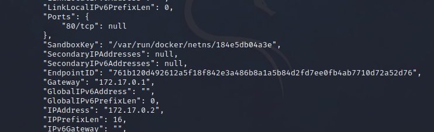


##### Остановить докер образ через docker stop [container_id|container_name]
##### Проверить, что образ остановился через docker ps
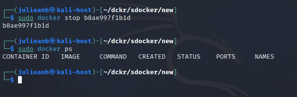


##### Запустить докер с замапленными портами 80 и 443 на локальную машину через команду run
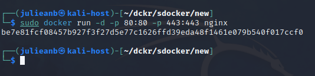


##### Проверить, что в браузере по адресу localhost:80 доступна стартовая страница nginx
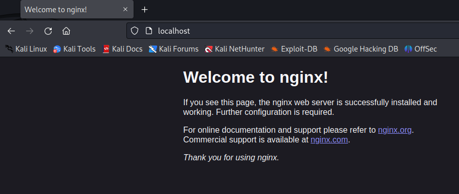


##### Перезапустить докер контейнер через docker restart [container_id|container_name]
##### Проверить любым способом, что контейнер запустился
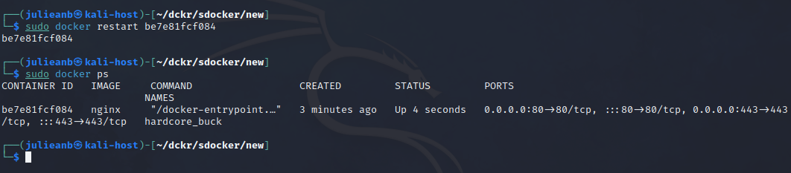


## Part 2. Операции с контейнером

**== Task ==**

##### Прочитать конфигурационный файл nginx.conf внутри докер контейнера через команду exec
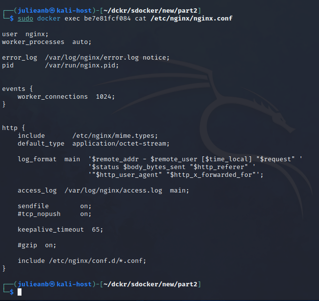


##### Создать на локальной машине файл nginx.conf


##### Настроить в нем по пути /status отдачу страницы статуса сервера nginx
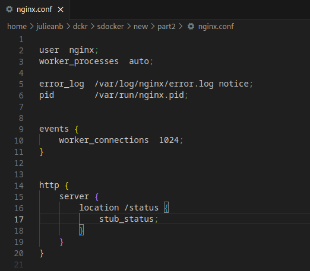


##### Скопировать созданный файл nginx.conf внутрь докер образа через команду docker cp
##### Перезапустить nginx внутри докер образа через команду exec
##### Проверить, что по адресу localhost:80/status отдается страничка со статусом сервера nginx
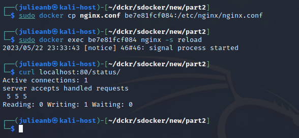


##### Экспортировать контейнер в файл container.tar через команду export
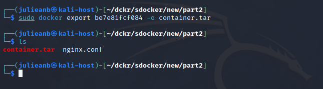


##### Остановить контейнер
##### Удалить образ через docker rmi [image_id|repository], не удаляя перед этим контейнеры
##### Удалить остановленный контейнер
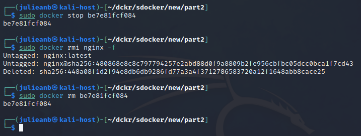


##### Импортировать контейнер обратно через команду import
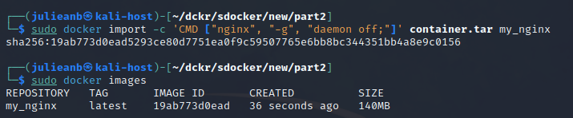


##### Запустить импортированный контейнер
##### Проверить, что по адресу localhost:80/status отдается страничка со статусом сервера nginx
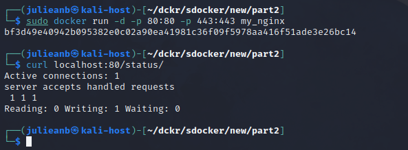


## Part 3. Мини веб-сервер

**== Task ==**

##### Написать мини сервер на C и FastCgi, который будет возвращать простейшую страничку с надписью Hello World!
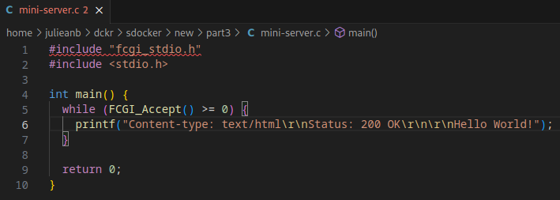


##### Написать свой nginx.conf, который будет проксировать все запросы с 81 порта на 127.0.0.1:8080
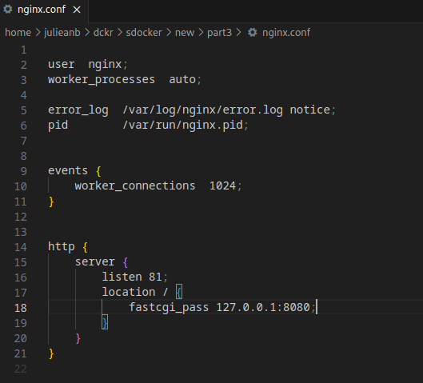


##### Запустить написанный мини сервер через spawn-fcgi на порту 8080
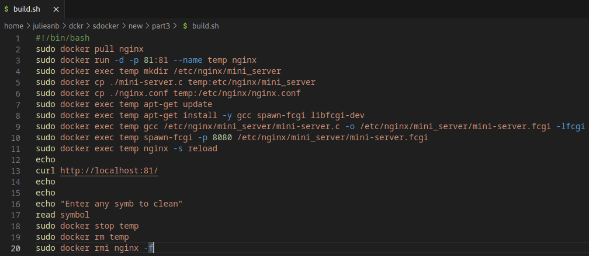


##### Проверить, что в браузере по localhost:81 отдается написанная вами страничка
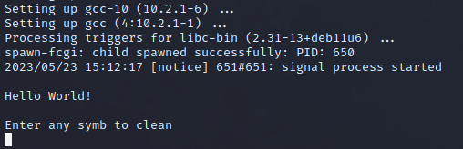


## Part 4. Свой докер

**== Task ==**

##### Написать свой докер образ, который:
1) собирает исходники мини сервера на FastCgi из Части 3
2) запускает его на 8080 порту
3) копирует внутрь образа написанный ./nginx/nginx.conf
4) запускает nginx.
5) Дописать в ./nginx/nginx.conf проксирование странички /status, по которой надо отдавать статус сервера nginx
6) Запустить собранный докер образ с маппингом 81 порта на 80 на локальной машине и маппингом папки ./nginx внутрь контейнера по адресу, где лежат конфигурационные файлы nginx'а
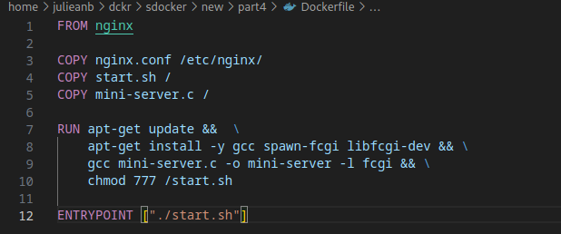
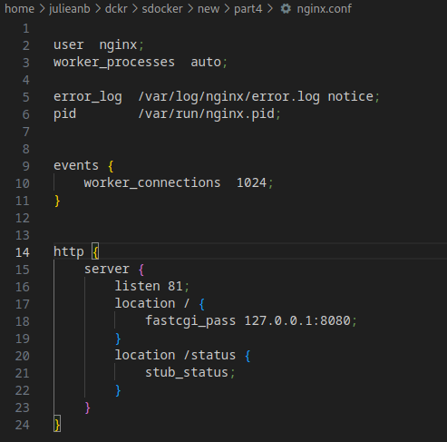
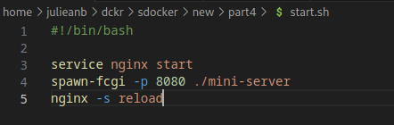
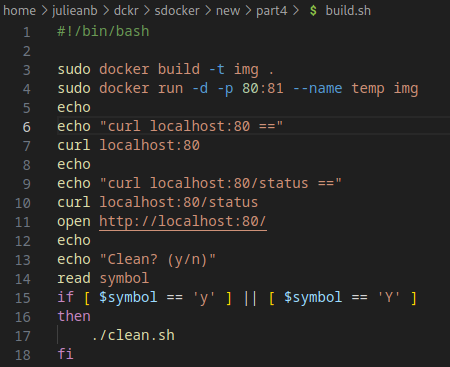

###### Проверить, что по localhost:80 доступна страничка написанного мини сервера
###### Проверить, что теперь по localhost:80/status отдается страничка со статусом nginx
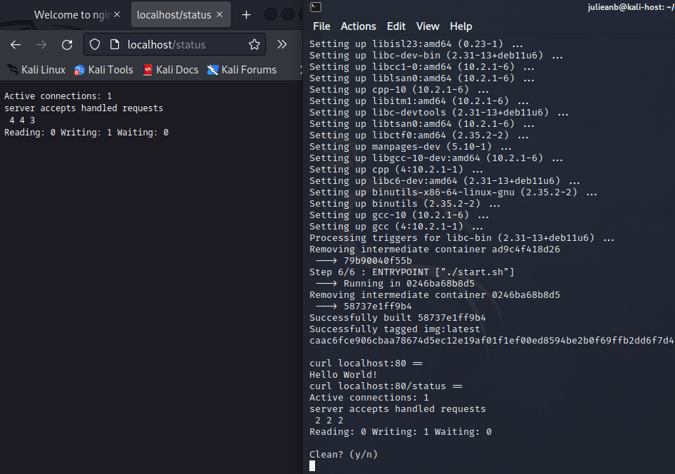


## Part 5. Dockle

**== Task ==**

##### Просканировать образ из предыдущего задания через dockle [image_id|repository]
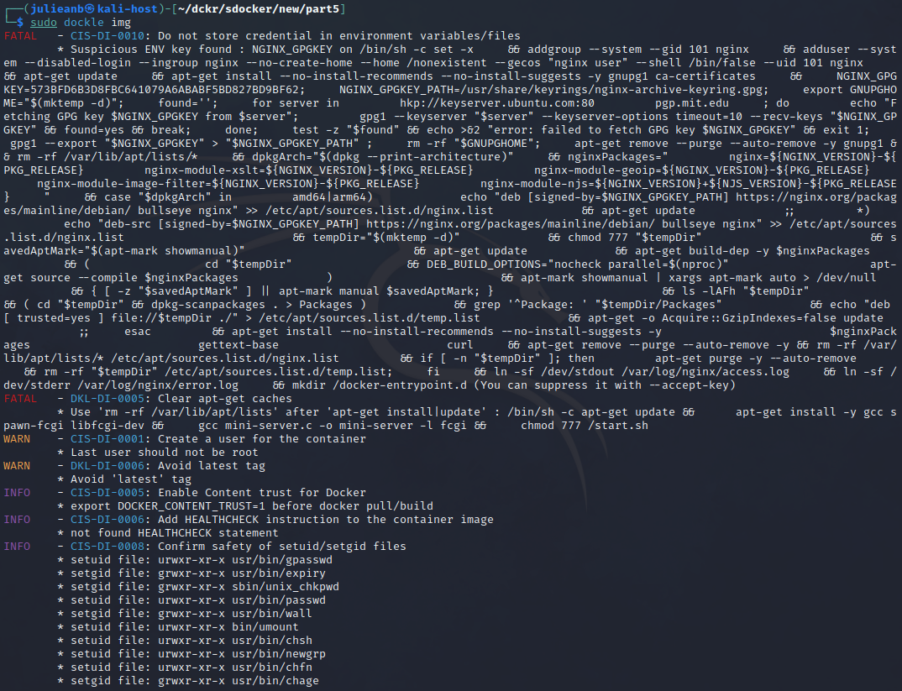


##### Исправить образ так, чтобы при проверке через dockle не было ошибок и предупреждений
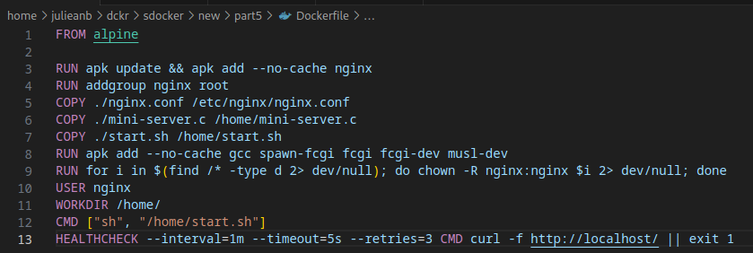
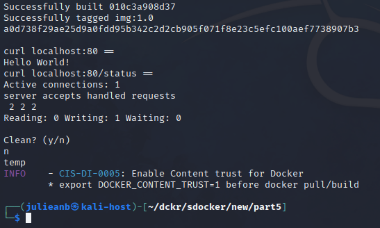


## Part 6. Базовый Docker Compose

**== Task ==**

##### Написать файл docker-compose.yml, с помощью которого:
1) Поднять докер контейнер из Части 5 (он должен работать в локальной сети, т.е. не нужно использовать инструкцию EXPOSE и мапить порты на локальную машину)
2) Поднять докер контейнер с nginx, который будет проксировать все запросы с 8080 порта на 81 порт первого контейнера
3) Замапить 8080 порт второго контейнера на 80 порт локальной машины
4) Собрать и запустить проект с помощью команд docker-compose build и docker-compose up
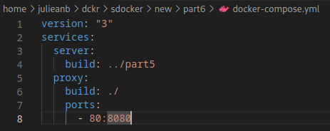
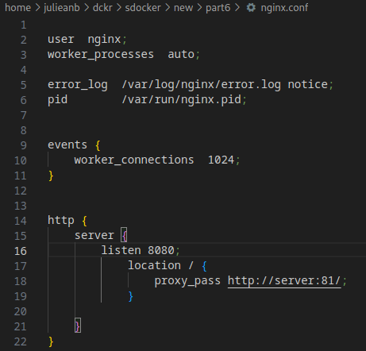


##### Проверить, что в браузере по localhost:80 отдается написанная вами страничка, как и ранее
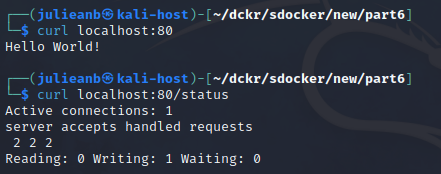


- Size: 67108864 = 64 Mb;
- Mapped ports: none;
- Container IP: 172.17.0.2


> Reading nginx conf file using cat through exec

##### Create a *nginx.conf* file on a local machine


> Pipeing output of previous step to nginx.conf file on local machine

##### Configure it on the */status* path to return the **nginx** server status page


> Adding location property to nginx.conf file on local machine

##### Copy the created *nginx.conf* file inside the docker image using the `docker cp` command


> Copying the conf file from local machine to container using CP

##### Restart **nginx** inside the docker image with *exec*


> Restarting nginx server in container through EXEC

##### Check that *localhost:80/status* returns the **nginx** server status page


> Checking return message of new page by CURL

##### Export the container to a *container.tar* file with the *export* command


> Exporting container and check its existance by ls

##### Stop the container


> Stopping container and check it with PS

##### Delete the image with `docker rmi [image_id|repository]`without removing the container first


> Deleting nginx image with force (-f) flag

##### Delete stopped container


> Deleting container that was previously exported

##### Import the container back using the *import* command


> Importing the container image with IMPORT

##### Run the imported container, Check that *localhost:80/status* returns the **nginx** server status page


> Starting the imported container with mapped ports and in backgroun (-d), command NGINX is necessary to start web server

- Add the following screenshots to the report:
    - the call and output of all commands used in this part of the task;
    - the contents of the created *nginx.conf* file;
    - the **nginx** server status page at *localhost:80/status*.


## Part 3. Mini web server

It's time to take a little break from the docker to prepare for the last stage. It's time to write your own server.

**== Task ==**

##### Write a mini server in **C** and **FastCgi** that will return a simple page saying `Hello World!`

- docker pull nginx
> Pulling image for nginx container
- docker run -d -p 81:81 nginx
> Running container with mapped 81 port
- docker exec 045f9b1a8218 apt update
> Updating APT to install packages
- docker exec 045f9b1a8218 apt install gcc libfcgi-dev spawn-fcgi -y
> Installing necessary packages: gcc - compiling source C code, libfcgi-dev - FastCGI library, spawn-fcgi - FastCGI daemon tool
- docker exec 045f9b1a8218 mkdir /etc/nginx/mini_server
> Creating directory for source code
- docker cp mini-server.c 045f9b1a8218:/etc/nginx/mini_server/
> Copying source code to container
- docker cp nginx.conf 045f9b1a8218:/etc/nginx/
> Copying nginx configuration file proxying 81 port to 8080 to container
- docker exec 045f9b1a8218 gcc /etc/nginx/mini_server/mini-server.c -o /etc/nginx/mini_server/mini-server.fcgi -lfcgi
> Compiling fastcgi server
- docker exec 045f9b1a8218 spawn-fcgi -p 8080 /etc/nginx/mini_server/mini-server.fcgi
> Starting FastCGI server on 8080 port

##### Run the written mini server via *spawn-fcgi* on port 8080


> Source code of mini server

##### Write your own *nginx.conf* that will proxy all requests from port 81 to *127.0.0.1:8080*


> Listening 81 port from 8080 in nginx configuration file

##### Check that browser on *localhost:81* returns the page you wrote


> Checking output on localhost:81

##### Put the *nginx.conf* file under *./nginx/nginx.conf* (you will need this later)

## Part 4. Your own docker

**== Task ==**

#### Write your own docker image that:
##### 1) builds mini server sources on FastCgi from [Part 3](#part-3-mini- web-server)
##### 2) runs it on port 8080
##### 3) copies inside the image written *./nginx/nginx.conf*
##### 4) runs **nginx**.
_**nginx** can be installed inside the docker itself, or you can use a ready-made image with **nginx** as base._
##### Build the written docker image with `docker build`, specifying the name and tag

- docker build . -t server-build:latest
> Building image from dockerfile in src with "server-build" name and "latest" tag

##### Check with `docker images` that everything is built correctly


> Building an image and checking it

##### Run the built docker image by mapping port 81 to 80 on the local machine and mapping the *./nginx* folder inside the container to the address where the **nginx** configuration files are located (see [Part 2](#part-2-operations-with-container))

- docker run -d -p 80:81 -v "$(PWD)"/nginx/:/etc/nginx/ server-build
> Running container in background (-d) with mapped port from host's 80 to container's 81 (-v), mapped folder (-v)

##### Check that the page of the written mini server is available on localhost:80

- curl localhost:80
> Checking main page of FastCGI server

##### Add proxying of */status* page in *./nginx/nginx.conf* to return the **nginx** server status


> Editing nginx configuration file to see the result of mounting folders

##### Restart docker image
*If everything is done correctly, after saving the file and restarting the container, the configuration file inside the docker image should update itself without any extra steps

- docker restart 41562b1f6a1a
> Restarting container to refresh nginx configuration file

##### Check that *localhost:80/status* now returns a page with **nginx** status

- curl localhost:80/status
> Checking if everything is up to date

## Part 5. **Dockle**

Once you've written the image, it's never a bad idea to check it for security.

**== Task ==**

##### Check the image from the previous task with `dockle [image_id|repository]`

- brew install goodwithtech/r/dockle
> Installing Dockle on MacOS from github repository


> List of errors and warnings

##### Fix the image so that there are no errors or warnings when checking with **dockle**

- First fatal error is solved by adding ```-ak NGINX_GPGKEY```;
- Second fatal error means that there is unnecessary caches on container, this is solved by adding additional instruction to clear caches;
- Add line USER nginx at the end of dockerfile to fix the first warning;
- The warning with tag can be fixed by rebuilding container with other than "latest" tag;


> Result of fixing errors and warnings in dockle

- First INFO can be fixed by:
> export DOCKER_CONTENT_TRUST=1
- Second INFO asks user to implement HEALTHCHECK instruction in Dockerfile to test availability of the server every 5 seconds for example;
> HEALTHCHECK --interval=5s --timeout=10s --retries=3 CMD curl --fail localhost || exit 1
- To fix third INFO it is needed to grant necessary rights to the list of files and folders.


> Result of fixing INFOs


> Final version of Dockerfile

## Part 6. Basic **Docker Compose**

**== Task ==**

##### Write a *docker-compose.yml* file, using which:
##### 1) Start the docker container from [Part 5](#part-5-dockle) _(it must work on local network, i.e., you don't need to use **EXPOSE** instruction and map ports to local machine)_


> Building container from part 5 Dockerfile without mapping ports
##### 2) Start the docker container with **nginx** which will proxy all requests from port 8080 to port 81 of the first container


> Nginx configuration file that makes server listen port 8080 and send requests to 81 port of first container

##### Map port 8080 of the second container to port 80 of the local machine


> Nginx container with mapped 8080 port to localhost port 80 and mapped nginx configuration file with proxying requests from second container port 8080 to first container with mini server port 81

##### Stop all running containers. Build and run the project with the `docker-compose build` and `docker-compose up` commands


> Checking absence of running containers, building and running two containers with `docker-compose` command

##### Check that the browser returns the page you wrote on *localhost:80* as before


> Checking two running containers and availability of web page at port 80
